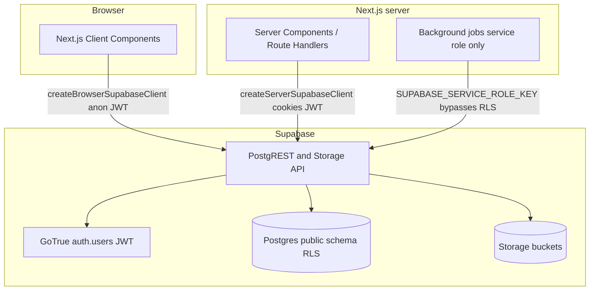

# Arbor data flow

High-level flow for the Supabase-backed MVP: authentication, Postgres with RLS, and private object storage.

## Postgres

- **cases** rows are owned by `attorney_id` → `auth.users.id`. All case-scoped reads and writes go through RLS comparing `auth.uid()` to that column or to cases reachable from it.
- **messages**, **behavioral_flags**, and **exports** are allowed when `case_id` belongs to a case whose `attorney_id` is `auth.uid()`.
- **audit_log** allows **insert** only with `actor_id = auth.uid()` and **select** only for rows where `actor_id = auth.uid()`. There are no **delete** policies on application tables (append-only).
- **behavioral_flags** integrity: a trigger requires `case_id` to match `messages.case_id` for the linked `message_id`.

## Storage

- Buckets: **raw-uploads**, **analysis-outputs** (private).
- Object keys must be `{case_uuid}/...` so policies can join to **cases** and enforce `attorney_id = auth.uid()`.
- Align `exports.file_path` with whatever convention the app uses when calling the Storage API (path within bucket vs full logical path), but keep it consistent.

## Clients (code)

- Browser: [`lib/supabase/client.ts`](lib/supabase/client.ts) — `createBrowserSupabaseClient()`.
- Server: [`lib/supabase/server.ts`](lib/supabase/server.ts) — `createServerSupabaseClient()` with Next.js `cookies()`.
- Types: [`lib/supabase/database.types.ts`](lib/supabase/database.types.ts), re-exported from [`lib/supabase/types.ts`](lib/supabase/types.ts).

Update this diagram when new data sources (e.g. Stripe, parsers) are wired in.
