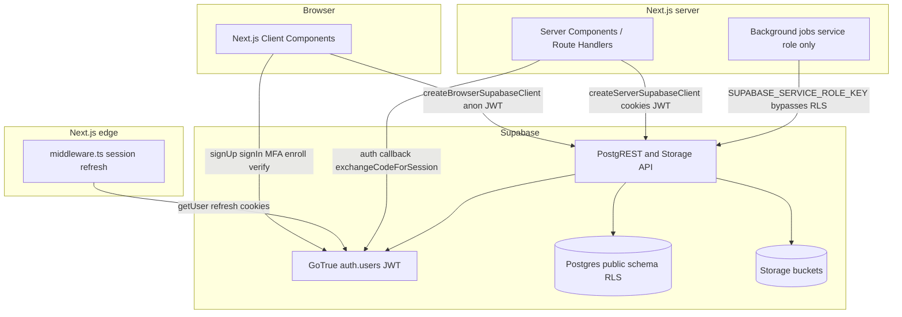

# Arbor data flow

High-level flow for the Supabase-backed MVP: authentication, Postgres with RLS, and private object storage.

## Authentication (MVP)

- **Middleware** ([`middleware.ts`](middleware.ts), [`lib/supabase/middleware.ts`](lib/supabase/middleware.ts)): runs `getUser()` on each matched request so the session can refresh via `Set-Cookie`. Paths under `/dashboard` require a user; otherwise redirect to `/login?redirectTo=…` (path validated in app code via [`lib/auth/safe-redirect.ts`](lib/auth/safe-redirect.ts)).
- **Email confirmation** ([`app/auth/callback/route.ts`](app/auth/callback/route.ts)): exchanges `?code=` for a session, then redirects (optional `next` query validated the same way as `redirectTo`).
- **Sign up** ([`app/(auth)/signup/page.tsx`](app/(auth)/signup/page.tsx)): `auth.signUp` with `user_metadata` (`bar_number`, `bar_verified: false`) and `emailRedirectTo` built from [`getValidatedPublicAppUrl`](lib/supabase/config.ts) + `/auth/callback`.
- **Sign in** ([`app/(auth)/login/page.tsx`](app/(auth)/login/page.tsx)): `signInWithPassword`; if AAL requires a second factor, `mfa.challengeAndVerify` with a verified TOTP factor. If the user has no verified TOTP yet, redirect to [`/dashboard/settings/mfa?onboarding=1`](app/(dashboard)/dashboard/settings/mfa/page.tsx) (prompt only—middleware does not enforce AAL2 on every request).
- **MFA enrollment** ([`app/(dashboard)/dashboard/settings/mfa/page.tsx`](app/(dashboard)/dashboard/settings/mfa/page.tsx)): `mfa.enroll` (TOTP) → QR from Supabase → `mfa.challengeAndVerify` to verify.

## Postgres

- **cases** rows are owned by `attorney_id` → `auth.users.id`. All case-scoped reads and writes go through RLS comparing `auth.uid()` to that column or to cases reachable from it.
- **messages**, **behavioral_flags**, and **exports** are allowed when `case_id` belongs to a case whose `attorney_id` is `auth.uid()`.
- **audit_log** allows **insert** only with `actor_id = auth.uid()` and **select** only for rows where `actor_id = auth.uid()`. There are no **delete** policies on application tables (append-only).
- **behavioral_flags** integrity: a trigger requires `case_id` to match `messages.case_id` for the linked `message_id`.

## Storage

- Buckets: **raw-uploads**, **analysis-outputs** (private).
- Object keys must be `{case_uuid}/...` so policies can join to **cases** and enforce `attorney_id = auth.uid()`.
- Align `exports.file_path` with whatever convention the app uses when calling the Storage API (path within bucket vs full logical path), but keep it consistent.

## Clients (code)

- Browser: [`lib/supabase/client.ts`](lib/supabase/client.ts) — `createBrowserSupabaseClient()`.
- Server: [`lib/supabase/server.ts`](lib/supabase/server.ts) — `createServerSupabaseClient()` with Next.js `cookies()`.
- Middleware: [`lib/supabase/middleware.ts`](lib/supabase/middleware.ts) — `updateSessionInMiddleware()` with `createServerClient` and request/response cookie `getAll` / `setAll`.
- Types: [`lib/supabase/database.types.ts`](lib/supabase/database.types.ts), re-exported from [`lib/supabase/types.ts`](lib/supabase/types.ts).

Update this diagram when new data sources (e.g. Stripe, parsers) are wired in.
