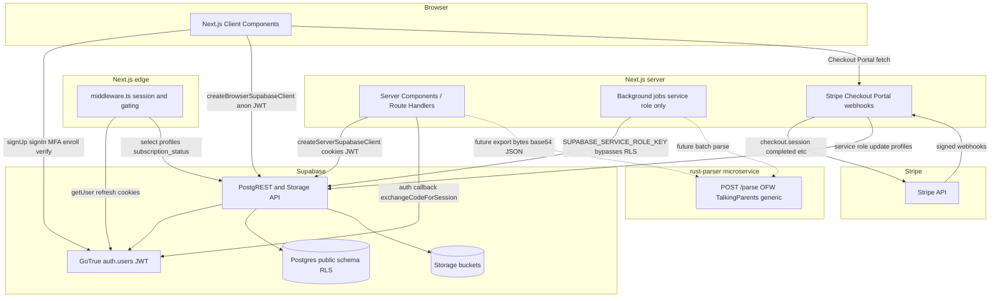

# Arbor data flow

High-level flow for the Supabase-backed MVP: authentication, Postgres with RLS, Stripe billing, and private object storage.

## Authentication (MVP)

- **Middleware** ([`middleware.ts`](middleware.ts), [`lib/supabase/middleware.ts`](lib/supabase/middleware.ts)): runs `getUser()` on each matched request so the session can refresh via `Set-Cookie`. Paths under `/dashboard` require a user; otherwise redirect to `/login?redirectTo=…` (path validated in app code via [`lib/auth/safe-redirect.ts`](lib/auth/safe-redirect.ts)). After auth, `/dashboard` routes (except [`/dashboard/settings/billing`](app/(dashboard)/dashboard/settings/billing/page.tsx)) require `profiles.subscription_status` in `active` or `beta`; otherwise redirect to [`/subscribe`](app/(auth)/subscribe/page.tsx). If the profile query fails, the request is allowed through (fail open) so a temporary API issue does not hard-lock the app.
- **Email confirmation** ([`app/auth/callback/route.ts`](app/auth/callback/route.ts)): exchanges `?code=` for a session, then redirects (optional `next` query validated the same way as `redirectTo`).
- **Sign up** ([`app/(auth)/signup/page.tsx`](app/(auth)/signup/page.tsx)): `auth.signUp` with `user_metadata` (`bar_number`, `bar_verified: false`) and `emailRedirectTo` built from [`getValidatedPublicAppUrl`](lib/supabase/config.ts) + `/auth/callback`.
- **Sign in** ([`app/(auth)/login/page.tsx`](app/(auth)/login/page.tsx)): `signInWithPassword`; if AAL requires a second factor, `mfa.challengeAndVerify` with a verified TOTP factor. If the user has no verified TOTP yet, redirect to [`/dashboard/settings/mfa?onboarding=1`](app/(dashboard)/dashboard/settings/mfa/page.tsx) (prompt only—middleware does not enforce AAL2 on every request).
- **MFA enrollment** ([`app/(dashboard)/dashboard/settings/mfa/page.tsx`](app/(dashboard)/dashboard/settings/mfa/page.tsx)): `mfa.enroll` (TOTP) → QR from Supabase → `mfa.challengeAndVerify` to verify.

## Postgres

- **profiles** (one row per `auth.users.id`): Stripe customer/subscription ids, `subscription_status`, `subscription_plan`, and bar metadata. **Select** and **update** only where `id = auth.uid()`; row creation is via an `auth.users` insert trigger (and migration backfill). Stripe webhooks update **profiles** with [`createServiceRoleSupabaseClient`](lib/supabase/service-role.ts) (bypasses RLS).
- **cases** rows are owned by `attorney_id` → `auth.users.id`. All case-scoped reads and writes go through RLS comparing `auth.uid()` to that column or to cases reachable from it.
- **messages**, **behavioral_flags**, and **exports** are allowed when `case_id` belongs to a case whose `attorney_id` is `auth.uid()`.
- **audit_log** allows **insert** only with `actor_id = auth.uid()` and **select** only for rows where `actor_id = auth.uid()`. There are no **delete** policies on application tables (append-only).
- **behavioral_flags** integrity: a trigger requires `case_id` to match `messages.case_id` for the linked `message_id`.

## Stripe

- **Checkout** ([`app/api/stripe/checkout/route.ts`](app/api/stripe/checkout/route.ts)): authenticated user, Stripe Customer + Checkout Session; success redirects to `/dashboard?session_id=…`, cancel to `/subscribe`.
- **Customer Portal** ([`app/api/stripe/portal/route.ts`](app/api/stripe/portal/route.ts)): returns a portal URL; return path [`/dashboard/settings/billing`](app/(dashboard)/dashboard/settings/billing/page.tsx).
- **Webhooks** ([`app/api/webhooks/stripe/route.ts`](app/api/webhooks/stripe/route.ts)): verifies `STRIPE_WEBHOOK_SECRET` (Node runtime, raw body). Updates **profiles** on `checkout.session.completed` (re-fetches the session with `expand: ['subscription']` if the payload omits the subscription id), `customer.subscription.created` / `customer.subscription.updated` when status is `active` or `trialing` (uses `metadata.supabase_user_id` or falls back to `stripe_customer_id`), `customer.subscription.deleted`, and `invoice.payment_failed`. Register these event types on the Stripe webhook endpoint.
- **Billing URL**: [`/settings/billing`](app/settings/billing/page.tsx) redirects to `/dashboard/settings/billing`.

## Storage

- Buckets: **raw-uploads**, **analysis-outputs** (private).
- Object keys must be `{case_uuid}/...` so policies can join to **cases** and enforce `attorney_id = auth.uid()`.
- Align `exports.file_path` with whatever convention the app uses when calling the Storage API (path within bucket vs full logical path), but keep it consistent.

## Clients (code)

- Browser: [`lib/supabase/client.ts`](lib/supabase/client.ts) — `createBrowserSupabaseClient()`.
- Server: [`lib/supabase/server.ts`](lib/supabase/server.ts) — `createServerSupabaseClient()` with Next.js `cookies()`.
- Middleware: [`lib/supabase/middleware.ts`](lib/supabase/middleware.ts) — `updateSessionInMiddleware()` with `createServerClient` and request/response cookie `getAll` / `setAll`; returns the same `supabase` client for `profiles` reads in [`middleware.ts`](middleware.ts).
- Service role (server-only): [`lib/supabase/service-role.ts`](lib/supabase/service-role.ts) — `createServiceRoleSupabaseClient()` for trusted Route Handlers.
- Stripe server: [`lib/stripe/server.ts`](lib/stripe/server.ts), config/price validation [`lib/stripe/config.ts`](lib/stripe/config.ts).
- Types: [`lib/supabase/database.types.ts`](lib/supabase/database.types.ts), re-exported from [`lib/supabase/types.ts`](lib/supabase/types.ts).

Update this diagram when new data sources (e.g. parsers) are wired in.

## rust-parser (co-parenting exports)

- **Service** ([`rust-parser/`](rust-parser/)): standalone Axum app on port **8080** — `GET /health`, `POST /parse` with base64 file payload and format enum (`ofw_pdf`, `talkingparents_pdf`, `generic_text`). Returns normalized `MessageRecord` rows, `parse_errors` for PDF/text failures, and `platform_detected`. Intended to be called from a future upload or job pipeline after an export is read from **raw-uploads** (not wired in the Next.js app yet).
